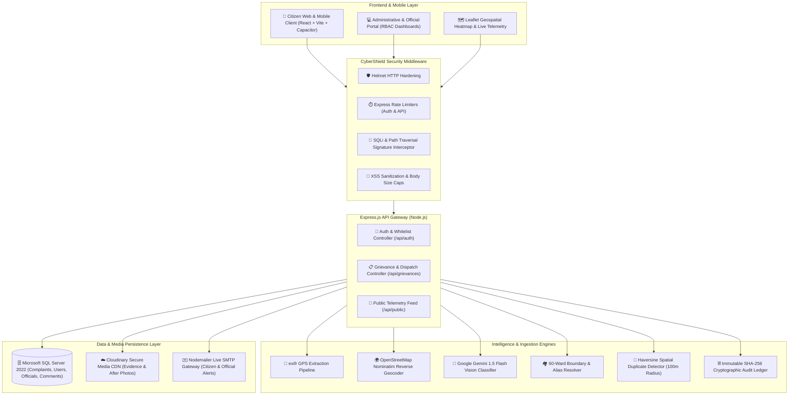
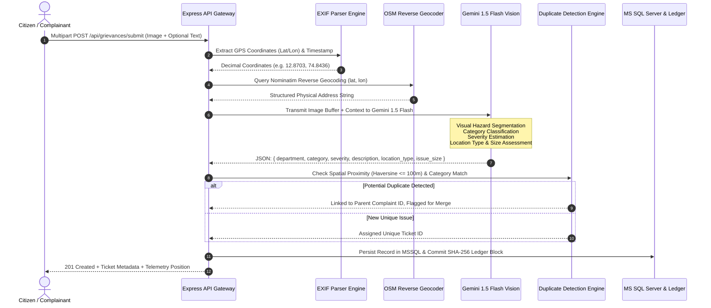
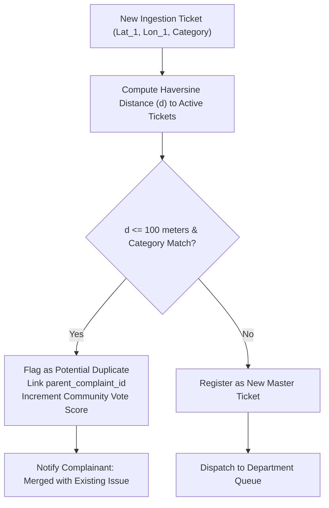
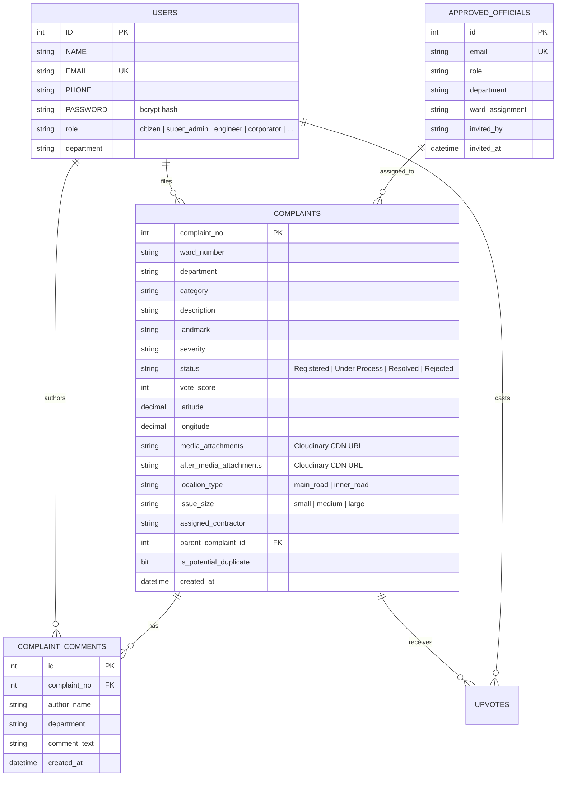

<div align="center">

# 🏛️ CivicSense™ — Next-Gen Civic Grievance & Municipal Intelligence Platform

[](https://nodejs.org/)
[](https://reactjs.org/)
[](https://vitejs.dev/)
[](https://www.microsoft.com/sql-server)
[](https://deepmind.google/technologies/gemini/)
[](https://leafletjs.com/)
[](#-defense-in-depth-security-architecture)
[](#-tamper-evident-blockchain-audit-ledger)
[](https://capacitorjs.com/)
[](LICENSE)

<p align="center">
  <b>A zero-friction, AI-orchestrated civic responsibility engine connecting citizens with municipal authorities across all 60 wards of Mangaluru with automated EXIF geocoding, computer vision triage, spatial duplicate suppression, and cryptographic blockchain accountability.</b>
</p>

[Explore Live Telemetry](#-interactive-telemetry--gis-heatmaps) • [System Architecture](#-system-architecture) • [AI & Vision Pipeline](#-ai--computer-vision-triage-pipeline) • [Security Suite](#-defense-in-depth-security-architecture) • [Quickstart Guide](#-quickstart--installation)

---

</div>

## 📑 Table of Contents
1. [Executive Briefing & Problem Landscape](#-executive-briefing--problem-landscape)
2. [Key Innovations & Platform Highlights](#-key-innovations--platform-highlights)
3. [System Architecture](#-system-architecture)
4. [AI & Computer Vision Triage Pipeline](#-ai--computer-vision-triage-pipeline)
5. [Spatial Intelligence & 60-Ward Geofencing](#-spatial-intelligence--60-ward-geofencing)
6. [Spatial-Temporal Duplicate Detection Engine](#-spatial-temporal-duplicate-detection-engine)
7. [Tamper-Evident Blockchain Audit Ledger](#-tamper-evident-blockchain-audit-ledger)
8. [Municipal Hierarchy & Role-Based Access Control](#-municipal-hierarchy--role-based-access-control-rbac)
9. [Defense-in-Depth Security Architecture](#-defense-in-depth-security-architecture)
10. [Database Schema & Migration Engine](#-database-schema--migration-engine)
11. [REST API Specification](#-rest-api-specification)
12. [Interactive Telemetry & GIS Heatmaps](#-interactive-telemetry--gis-heatmaps)
13. [Mobile Portability (Android & iOS)](#-mobile-portability-android--ios)
14. [Quickstart & Installation](#-quickstart--installation)
15. [Environment Configuration Reference](#-environment-configuration-reference)
16. [Contributing & License](#-contributing--license)

---

## 🌍 Executive Briefing & Problem Landscape

Municipal governance in fast-growing urban centers faces significant operational bottlenecks:

| Traditional Grievance Bottleneck | How CivicSense™ Solves It |
| :--- | :--- |
| **Bureaucratic Friction**: Citizens must manually categorize issues into complex departments (e.g., MCC vs. MESCOM vs. Water Board). | **Zero-Config AI Dispatch**: Google Gemini 1.5 Flash vision model parses image pixels to classify departments, assess hazard severities, and generate descriptions automatically. |
| **Location Imprecision**: Text-based address descriptions ("near the bakery") cause delayed emergency dispatches and wasted fuel. | **EXIF Telemetry & OSM Reverse Geocoding**: GPS decimal coordinates are extracted straight from raw image bytes and reverse-geocoded to street-level fidelity without human intervention. |
| **Ticket Spam & Fragmented Reports**: 20 citizens reporting the same pothole create 20 disconnected tickets. | **Spatial Haversine Clustering**: Reports within a 100-meter radius of the same category are merged into a unified master ticket with aggregated community upvotes. |
| **Accountability Deficit**: Status updates ("Resolved") often lack proof, breeding civic cynicism. | **Proof-of-Work Verification + Blockchain Ledger**: Requires photographic "After" evidence and seals all state transitions into an append-only SHA-256 cryptographic audit chain. |

---

## ⚡ Key Innovations & Platform Highlights

- 📸 **Single-Tap Grievance Ingestion**: Drop a photo, video, or snapshot; EXIF metadata parser (`exifr`) extracts exact latitude/longitude coordinates instantly.
- 🧠 **Google Gemini 1.5 Flash Vision AI**: Multimodal reasoning parses street hazards, detects defect dimensions, estimates risk severities, and generates municipal triage summaries.
- 🗺️ **60-Ward Geofencing Engine**: Hardened alias resolution matrix indexing all 60 electoral wards of Mangaluru Municipal Corporation (Surathkal West to Kasba Bengre).
- ⛓️ **Cryptographic SHA-256 Audit Trail**: Local immutable blockchain ledger recording every ticket creation, status update, contractor assignment, and resolution hash.
- 👥 **Multi-Tier Municipal RBAC Matrix**: Dedicated operational workspaces for Super Admins, Ward Corporators, Executive Engineers (EE), Assistant Engineers (AE), Linemen, Health Inspectors, and Empanelled Contractors.
- 🛡️ **CyberShield Defense-in-Depth**: OWASP-aligned security layer featuring SQL injection signature interception, path traversal blockers, brute-force rate limiters, and XSS sanitization.
- 🔥 **Live GIS Heatmap & Telemetry**: Dynamic Leaflet & Leaflet.heat map engine visualizing municipal hazard clusters, ward severity rankings, and real-time resolution metrics.
- 📱 **Native Mobile Portability**: Built with Capacitor 6 for native Android and iOS APK/AAB distribution with hardware camera and geolocation access.

---

## 🏛️ System Architecture

CivicSense operates on a decoupled client-server micro-architecture engineered for high throughput, data integrity, and deterministic triage:



---

## 🤖 AI & Computer Vision Triage Pipeline

When an image is submitted, CivicSense executes a 5-stage automated perception pipeline:



### Deterministic Urgency & Severity Matrix

If the AI operates in hybrid mode or fallback is triggered, CivicSense applies a deterministic severity matrix based on roadway infrastructure and defect volume:

$$\text{Severity} = f(\text{Location Type}, \text{Issue Size})$$

| Roadway Classification | Defect Size / Volume | Assigned Severity Rating | SLA Target |
| :--- | :--- | :--- | :--- |
| **Main Road / Highway / Junction** | Large (Crater / Flooding / Burst) | 🔴 **High** (Immediate Public Safety Danger / Outage) | 12 - 24 Hours |
| **Main Road / Highway / Junction** | Medium (Pothole / Debris) | 🔴 **High** (Immediate Public Safety Danger / Outage) | 24 Hours |
| **Main Road / Highway / Junction** | Small (Minor Crack / Patch) | 🟡 **Medium** (Hinders Daily Routine / Minor Hazard) | 48 Hours |
| **Inner Residential / Lane** | Large (Sewer Overflow / Tree Fall) | 🔴 **High** (Immediate Public Safety Danger / Outage) | 24 Hours |
| **Inner Residential / Lane** | Medium (Standard Pothole / Leak) | 🟡 **Medium** (Hinders Daily Routine / Minor Hazard) | 48 - 72 Hours |
| **Inner Residential / Lane** | Small (Streetlight Flickering) | 🟢 **Low** (General Maintenance / Inquiry) | 5 - 7 Days |

---

## 🗺️ Spatial Intelligence & 60-Ward Geofencing

CivicSense implements an exhaustive geographic alias matrix mapped to the 60 official wards of Mangaluru Municipal Corporation:

```
Mangaluru Municipal Corporation (60 Wards)
├── Zone 1 (Surathkal & Coastal North): Wards 1 to 10 (Surathkal, Katipalla, Idya, Hosabettu, Kulai, Baikampady)
├── Zone 2 (Airport Corridor & Panambur): Wards 11 to 20 (Panambur, Kunjathbail, Marakada, Kavoor, Pacchanady, Tiruvail)
├── Zone 3 (Central Residential): Wards 21 to 30 (Padavu, Kadri Padav, Derebail North/East/South/West, Boloor, Mannagudda, Kodialbail)
├── Zone 4 (Commercial & Administrative): Wards 31 to 40 (Bejai, Kadri North/South, Shivbagh, Padav, Maroli, Bendoor, Falnir, Court)
├── Zone 5 (Market & Port Area): Wards 41 to 50 (Central Market, Kudroli, Bunder, Port, Cantonment, Milagres, Valencia, Kankanady, Alape)
└── Zone 6 (Southern Corridor): Wards 51 to 60 (Alape North, Kannur, Bajal, Jeppinamogaru, Attavara, Mangaladevi, Hoigebazar, Bolara, Jeppu, Bengre)
```

Each complaint is programmatically bound to its municipal corporator and assigned engineering vector using coordinate geofencing and regex spatial alias matching.

---

## 🔄 Spatial-Temporal Duplicate Detection Engine

To prevent municipal queue flooding, every new complaint undergoes real-time spatial clustering against all open tickets:



The distance between coordinates $(\phi_1, \lambda_1)$ and $(\phi_2, \lambda_2)$ is computed using the Great-Circle Haversine Formula:

$$a = \sin^2\left(\frac{\Delta\phi}{2}\right) + \cos(\phi_1)\cos(\phi_2)\sin^2\left(\frac{\Delta\lambda}{2}\right)$$
$$d = 2 \cdot R \cdot \arcsin\left(\sqrt{a}\right) \quad \text{where } R = 6371 \text{ km}$$

If $d \le 0.1 \text{ km}$ (100 meters) and the categories match, the complaint is linked to the existing master thread, consolidating civic backing.

---

## ⛓️ Tamper-Evident Blockchain Audit Ledger

To prevent administrative tampering or false "Resolved" declarations, CivicSense maintains an append-only, Merkle-linked cryptographic ledger in `blockchain_ledger.json`.

```
┌────────────────────────────────────────────────────────┐
│                      GENESIS BLOCK                     │
│ Index: 0                                               │
│ Action: GENESIS_BLOCK                                  │
│ Hash: a89f...                                          │
│ PreviousHash: 0000000000000000000000000000000000000000 │
└──────────────────────────┬─────────────────────────────┘
                           │
                           ▼
┌────────────────────────────────────────────────────────┐
│                   BLOCK #1: TICKET_CREATED             │
│ Index: 1                                               │
│ Complaint ID: #1042                                    │
│ Action: COMPLAINT_FILED                                │
│ DataHash: sha256(GPS + Category + EvidenceURL)         │
│ PreviousHash: a89f...                                  │
│ BlockHash: sha256(Index + Timestamp + DataHash + Prev)│
└──────────────────────────┬─────────────────────────────┘
                           │
                           ▼
┌────────────────────────────────────────────────────────┐
│               BLOCK #2: STATUS_RESOLVED_VERIFIED       │
│ Index: 2                                               │
│ Complaint ID: #1042                                    │
│ Action: ISSUE_RESOLVED_AFTER_EVIDENCE                  │
│ DataHash: sha256(AfterPhotoURL + OfficialSignoff)      │
│ PreviousHash: Block #1 Hash                            │
│ BlockHash: sha256(Index + Timestamp + DataHash + Prev)│
└────────────────────────────────────────────────────────┘
```

The system verifies chain continuity on demand:
```javascript
const { verifyComplaintIntegrity } = require('./utils/blockchainLedger');
const status = verifyComplaintIntegrity(complaintNo, complaintPayload);
// Returns: { verified: true, blockIndex: 2, txHash: "3f7c...", chainCorrupted: false }
```

---

## 👥 Municipal Hierarchy & Role-Based Access Control (RBAC)

CivicSense implements an 8-tier hierarchical governance matrix with strict JWT verification:

```
👑 Super Admin (Full Platform Control, Whitelist Management, Cross-Ward Oversight)
│
├── 🏛️ Ward Corporators (Elected Councilors — Ward Specific Monitoring & Feedback)
│
├── 👷 Civil Engineering Vector (MCC)
│   ├── Executive Engineer (EE) / Assistant Executive Engineer (AEE)
│   ├── Assistant Engineer (AE) / Junior Engineer (JE)
│   └── Empanelled MCC Contractors / Ward Inspectors
│
├── ⚡ Electrical & Power Grid Vector (MESCOM)
│   ├── Executive Engineer (EE — Electrical)
│   ├── Section Officer (SO) / Assistant Engineer (AE)
│   └── Lineman / Junior Lineman (JLM) & MESCOM Contractors
│
├── 🚰 Water Supply & Sewage Board
│   ├── Assistant Executive Engineer (AEE — Water Supply)
│   └── Water Board Maintenance Contractors
│
├── 🐾 Stray Animal Welfare & Public Health
│   ├── Health Officer / Chief Veterinary Officer
│   ├── Senior/Junior Health Inspectors (SHI / JHI)
│   └── Animal Catching Squad / Field Handlers
│
└── 👤 Citizens (Lodge Grievances, Track Status, Community Upvoting, Verification)
```

---

## 🛡️ Defense-in-Depth Security Architecture

The backend implements a multi-layer **CyberShield™** security middleware:

```mermaid
flowchart LR
    Req["Incoming HTTP Request"] --> H["1. Helmet Hardening<br/>(CSP, CORP, Strict-Referrer)"]
    H --> RL["2. Rate Limiters<br/>(Auth: 25/15m, API: 300/15m)"]
    RL --> CORS["3. Origin & Header Policy<br/>(CORS Guard)"]
    CORS --> SizeCap["4. Buffer Overflow Protection<br/>(10MB Body Cap)"]
    SizeCap --> WAF["5. WAF Deep Inspector<br/>(SQLi & Path Traversal Block)"]
    WAF --> XSS["6. XSS Sanitizer<br/>(HTML Injection Neutralizer)"]
    XSS --> Timeout["7. Slowloris Defense<br/>(30s Timeout Monitor)"]
    Timeout --> Controller["Application Logic"]
```



### Security Highlights
- **Zero Secret Commits**: Real credentials exist exclusively in an unversioned `.env` file guarded by multiple `.gitignore` boundaries.
- **SQL Injection Interceptor**: Deep-scans nested payloads for SQL injection patterns (`UNION`, `DROP`, `XP_CMDSHELL`, `OR 1=1`) and rejects malicious packets with `400 Bad Request`.
- **Path Traversal Guard**: Scans string parameters for relative directory traversal signatures (`../`, `..\`).
- **Sanitized Global Error Handler**: Catches all unhandled server exceptions and returns standardized messages, preventing raw stack traces or database connection strings from leaking to clients.

---

## 🗄️ Database Schema & Migration Engine

CivicSense uses Microsoft SQL Server with an automated self-healing schema migrator (`backend/db.js`):



---

## 📡 REST API Specification

### Authentication & Official Whitelisting (`/api/auth`)

| Method | Endpoint | Access | Description |
| :--- | :--- | :--- | :--- |
| `POST` | `/api/auth/register` | Public | Enrolls a citizen account with bcrypt password hashing. |
| `POST` | `/api/auth/login` | Public | Authenticates credentials, evaluates whitelist status, and issues a 24-hour JWT token. |
| `POST` | `/api/auth/invite-official` | Super Admin | Whitelists an official email, assigns role/ward, and dispatches SMTP invitation. |
| `GET` | `/api/auth/officials` | Super Admin | Retrieves all whitelisted municipal officials and ward assignments. |
| `DELETE`| `/api/auth/officials/:email` | Super Admin | Revokes official administrative privileges. |

### Grievance Operations & Telemetry (`/api/grievances`)

| Method | Endpoint | Access | Description |
| :--- | :--- | :--- | :--- |
| `POST` | `/api/grievances/submit` | Citizen | Uploads evidence, extracts EXIF coordinates, runs Gemini Vision AI, and records ticket. |
| `GET` | `/api/grievances/my-logs` | Citizen | Returns grievance records filed by the authenticated citizen. |
| `GET` | `/api/grievances/department-feed` | Officials | Returns filtered grievances matching the official's department and ward assignment. |
| `PATCH`| `/api/grievances/:id/upvote` | Citizen | Casts an upvote on an issue, enforcing single-vote integrity. |
| `PATCH`| `/api/grievances/:id/status` | Officials | Updates ticket status (`Under Process`, `Resolved`), logging state transitions. |
| `POST` | `/api/grievances/:id/verify` | Officials | Resolves issue with mandatory photographic "After" evidence and seals blockchain block. |
| `POST` | `/api/grievances/:id/comments` | Officials | Appends department remark to complaint timeline. |
| `GET` | `/api/grievances/:id/audit-chain`| Public | Returns the cryptographic SHA-256 blockchain verification proof for a ticket. |
| `GET` | `/api/public/complaints` | Public | High-speed parameterized query endpoint for global GIS map markers and heatmaps. |

---

## 🗺️ Interactive Telemetry & GIS Heatmaps

The frontend embeds Leaflet and `Leaflet.heat` for geospatial visualization:

- **Density Heatmap**: Generates weighted Gaussian gradient kernels based on complaint frequency and severity density across Mangaluru.
- **Dynamic Filtering**: Filter active pins by Department (MCC, MESCOM, Water Board, Health), Status (Registered, In Progress, Resolved), or Severity.
- **Geolocated Focus**: Tap any ticket in your dashboard to animate the map directly to its GPS coordinate coordinates with custom status markers.

---

## 📱 Mobile Portability (Android & iOS)

CivicSense is natively wrapped using Capacitor 6:

```bash
# Step 1: Build the optimized React production bundle
cd frontend
npm run build

# Step 2: Synchronize web assets to native Android project
npx cap sync android

# Step 3: Launch in Android Studio for APK/AAB compilation
npx cap open android
```

### Native Permissions Configured
- `CAMERA`: Capturing immediate evidence photos on-site.
- `ACCESS_FINE_LOCATION` & `ACCESS_COARSE_LOCATION`: High-accuracy real-time GPS telemetry.
- `READ_MEDIA_IMAGES` / `READ_EXTERNAL_STORAGE`: Selecting media from gallery with EXIF metadata preservation.

---

## 🚀 Quickstart & Installation

### Prerequisites
- **Node.js** (v18.x or higher)
- **npm** (v9.x or higher)
- **Microsoft SQL Server** (2019/2022 local `SQLEXPRESS` or Azure SQL with TCP/IP enabled)

### Step 1: Clone Repository
```bash
git clone https://github.com/AmithColaco/Civic_Responsibilty.git
cd Civic_Responsibilty
```

### Step 2: Backend Setup
```bash
cd backend
npm install

# Create local environment configuration from template
cp .env.example .env
```
*Configure your database credentials, Cloudinary keys, and Gemini API key in `backend/.env`.*

```bash
# Start the OWASP-hardened Express backend
node server.js
```
*The database migrator will automatically check, create, and seed all schemas, super admin accounts, and 60-ward official records on startup.*

### Step 3: Frontend Setup
```bash
cd ../frontend
npm install

# Start Vite hot-reloading development server
npm run dev
```

Open `http://localhost:5173` in your browser.

---

## ⚙️ Environment Configuration Reference

Create a `backend/.env` file based on `backend/.env.example`:

```ini
# Server Port
PORT=8000

# Microsoft SQL Server Connection Matrix
DB_USER=sa
DB_PASSWORD=your_db_password
DB_SERVER=localhost
DB_INSTANCE=SQLEXPRESS
DB_NAME=CivicSense

# JWT Authentication Secret Key
JWT_SECRET=your_super_secret_jwt_key_here

# Cloudinary Media Storage CDN
CLOUDINARY_CLOUD_NAME=your_cloudinary_cloud_name
CLOUDINARY_API_KEY=your_cloudinary_api_key
CLOUDINARY_API_SECRET=your_cloudinary_api_secret

# Google Gemini Vision API (Multimodal Triage)
GEMINI_API_KEY=your_gemini_api_key_here

# SMTP Live Email Delivery Configuration (Nodemailer)
SMTP_HOST=smtp.gmail.com
SMTP_PORT=587
SMTP_SECURE=false
SMTP_USER=your_notifications_email@gmail.com
SMTP_PASS=your_gmail_app_password
SMTP_FROM="CivicSense Notifications" <noreply@civicsense.mangaluru.in>
```

---

## 👥 Default Accounts (Auto-Seeded)

For testing and local demonstration, the database auto-seeds:

| Account Type | Email | Password | Assigned Scope |
| :--- | :--- | :--- | :--- |
| **Super Admin** | `amithcolaco@gmail.com` | `Winston@2006` | Global Administration & Whitelisting |
| **Super Admin Portal** | `admin@civicsense.in` | `Winston@2006` | Global Administration |
| **MCC Admin** | `admin@mangaluru.gov.in` | `Winston@2006` | City Municipal Oversight |
| **Corporator (Ward 18)** | `corporator.kavoor@mangaluru.gov.in` | `qwerty` | Ward 18 - Kavoor |
| **Corporator (Ward 15)** | `dhritim07@gmail.com` | `qwerty` | Ward 15 - Kunjathbail South |

---

## 📄 Contributing & License

Contributions are welcome! Please create a feature branch, commit your changes, and open a Pull Request.

Distributed under the **MIT License**. See `LICENSE` for more information.

<div align="center">
  <sub>Built with ❤️ for civic responsibility, transparent governance, and smarter cities.</sub>
</div>