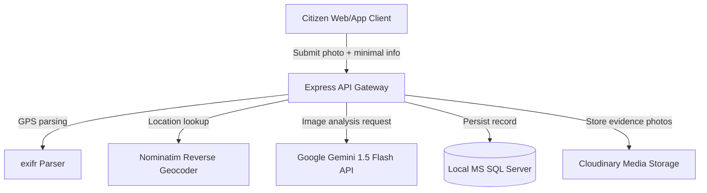

# CivicSense 🏛️

CivicSense is a community-driven civic grievance portal designed to bridge the gap between citizens and municipal administration. By uploading simple photo evidence of neighborhood issues (such as potholes, stray animal hazards, power line sparkings, or sewer leaks), citizens can log and track complaints without navigating complicated red tape.

---

## 1. Problem Statement
Reporting civic grievances to municipal corporations is historically plagued by friction:
*   **Manual Categorization**: Citizens are forced to navigate bureaucracy to figure out which government department handles their specific concern.
*   **Geotagging Overhead**: Expressing exact locations is prone to human error, hindering dispatch efforts.
*   **Lack of Tracking**: Traditional systems lack transparency, offering citizens no visibility into whether action has been taken or when an issue is resolved.

---

## 2. Proposed Solution
**CivicSense** simplifies civic responsibility into a single upload action:
1.  **Minimized Filing Form**: Citizens upload photo/video evidence with optional descriptions.
2.  **EXIF-Based Geolocation**: The backend automatically extracts GPS metadata from the image to resolve precise decimal coordinates.
3.  **Gemini AI-Powered Routing**: An integrated AI classifier parses the visual evidence and comments to identify the core issue, write a detailed description, assess severity, and assign the ticket to the correct municipal vector.
4.  **Community Backing and Validation**: Citizens can track active complaints, back (upvote) community tickets, and officially resolve issues by uploading an "after photo" verification.

---

## 3. Features
*   **Minimal Data Entry**: No required manual ward selection, agency lookup, or landmark details.
*   **AI Smart Classifier**: Integrated with Google Gemini 1.5 Flash to dynamically analyze images.
*   **OSM Reverse Geocoding**: Translates raw EXIF coordinates into physical address structures using OpenStreetMap's Nominatim.
*   **Dynamic Telemetry Map**: Interactive geospatial visualization of active complaints using Leaflet and Density Heatmaps.
*   **Ledger Upvoting System**: Secure database join restrictions ensuring one unique backing vote per citizen per issue.
*   **Capacitor Native Wrapping**: Portability templates allowing compiling into native Android/iOS applications.

---

## 4. Architecture


---

## 5. Tech Stack
*   **Frontend**: React (Vite, React Router, Leaflet, React Leaflet, Leaflet.heat, Vanilla CSS)
*   **Backend**: Node.js, Express, `mssql` (SQL Server Connection Pool Client), `exifr` (EXIF extractor), `multer`, `multer-storage-cloudinary`
*   **AI & Geocoding**: Google Gemini API, OpenStreetMap Nominatim reverse-geocoder
*   **Mobile Portability**: Capacitor CLI / Core (supporting platform compile-targets)

---

## 6. Project Structure
```
Civic_Responsibilty/
├── backend/
│   ├── routes/
│   │   ├── auth.js            # Login, registration, and session signing
│   │   └── grievances.js      # AI classification, upload, and upvoting
│   ├── uploads/               # Temporary disk storage for image streams
│   ├── .env                   # Local credentials and API keys configuration
│   ├── db.js                  # Database connection pool and schema migrator
│   ├── package.json
│   └── server.js              # Application entrypoint
├── frontend/
│   ├── src/
│   │   ├── components/        # Reusable UI widgets (welcome card, map layers)
│   │   ├── pages/             # Auth pages & dashboard tracking panels
│   │   ├── config.js          # Dynamic host resolver mapping
│   │   └── App.jsx            # React client-side route manager
│   ├── capacitor.config.json  # Mobile app compiler setup
│   ├── package.json
│   └── vite.config.js
└── capacitor.config.json      # Mobile app root configuration descriptor
```

---

## 7. Prerequisites
Before setting up the project, make sure you have the following installed:
*   **Node.js** (v18.x or higher)
*   **npm** (v9.x or higher)
*   **Microsoft SQL Server** (local `SQLEXPRESS` instance with TCP/IP enabled)

---

## 8. Setup and Installation

### Step 1: Database Setup
Create a new database in SQL Server called `CivicSense`. Ensure SQL Server Authentication is enabled.

### Step 2: Backend Setup
1.  Navigate to the backend directory:
    ```bash
    cd backend
    ```
2.  Install dependencies:
    ```bash
    npm install
    ```
3.  Configure the `.env` file (see [Environment Variables](#11-environment-variables) section below).

### Step 3: Frontend Setup
1.  Navigate to the frontend directory:
    ```bash
    cd ../frontend
    ```
2.  Install dependencies:
    ```bash
    npm install
    ```

---

## 9. Usage

### Starting the Applications
1.  **Run Backend Server** (from `backend/`):
    ```bash
    node server.js
    ```
2.  **Run Frontend Client** (from `frontend/`):
    ```bash
    npm run dev
    ```
3.  Open `http://localhost:5173` in your browser.

### Filing a Grievance
*   Log into your account or register a profile.
*   Navigate to **File Grievance**.
*   Select a photo of the issue.
*   Add optional comments and click **Submit Grievance**.
*   The AI will auto-categorize the concern and plot it on the telemetry dashboard.

---

## 10. API Reference

### Authentication Routes ([auth.js](file:///c:/Users/amith/Music/desktop/Civic_Responsibilty/backend/routes/auth.js))
*   `POST /api/auth/register` - Registers a new citizen profile.
*   `POST /api/auth/login` - Authenticates user and returns JWT.

### Grievance Routes ([grievances.js](file:///c:/Users/amith/Music/desktop/Civic_Responsibilty/backend/routes/grievances.js))
*   `POST /api/grievances/submit` - Receives grievance uploads, runs EXIF extraction and Gemini AI analysis, and saves the ticket.
*   `GET /api/grievances/my-logs` - Fetches grievances reported by the authenticated citizen.
*   `GET /api/grievances/public-feed` - Fetches global community telemetry and upvoting status.
*   `PATCH /api/grievances/:id/upvote` - Increments the vote score of a complaint, enforcing unique ledger rules.
*   `POST /api/grievances/:complaintNo/verify` - Updates ticket status to `Resolved` and attaches resolution confirmation media.

---

## 11. Environment Variables
Create a `.env` file inside the `backend/` directory with the following variables:

| Variable | Description | Example Value |
| :--- | :--- | :--- |
| `PORT` | Local port for Express server | `8000` |
| `DB_USER` | SQL Server authentication user | `sa` |
| `DB_PASSWORD` | SQL Server user password | `your_db_password` |
| `DB_SERVER` | Server host IP/hostname | `localhost` |
| `DB_INSTANCE` | SQL Server instance name | `SQLEXPRESS` |
| `DB_NAME` | Database catalog name | `CivicSense` |
| `JWT_SECRET` | Key used to sign authorization tokens | `super_secret_string` |
| `CLOUDINARY_CLOUD_NAME`| Cloudinary cloud identifier | `your_cloudinary_name` |
| `CLOUDINARY_API_KEY` | Cloudinary access API key | `1234567890` |
| `CLOUDINARY_API_SECRET`| Cloudinary secret API credentials | `secret_credentials` |
| `GEMINI_API_KEY` | (Optional) Google Generative AI API key | `AIzaSy...` |

---

## 12. GitHub Actions Integration
For continuous integration, compile checking can be set up using a workflow file `.github/workflows/ci.yml`:

```yaml
name: CivicSense CI

on:
  push:
    branches: [ main ]
  pull_request:
    branches: [ main ]

jobs:
  build:
    runs-on: ubuntu-latest
    steps:
    - uses: actions/checkout@v3
    - name: Use Node.js
      uses: actions/setup-node@v3
      with:
        node-version: 18
    - name: Build Backend
      run: |
        cd backend
        npm ci
    - name: Build Frontend
      run: |
        cd frontend
        npm ci
        npm run build
```

---

## 13. Troubleshooting
*   **Database Connections**: Ensure TCP/IP connections are enabled in SQL Server Configuration Manager (under SQL Server Network Configuration). Ensure SQL Server Browser service is running if using named instances.
*   **Missing EXIF Data**: If an uploaded photo has no GPS metadata, the backend uses location coordinates centered around Mangaluru.
*   **Gemini API Failures**: If no `GEMINI_API_KEY` is set or the service times out, the backend gracefully falls back to local rule-based routing to keep the application operational.

---

## 14. License
Distributed under the MIT License. See `LICENSE` for more information.